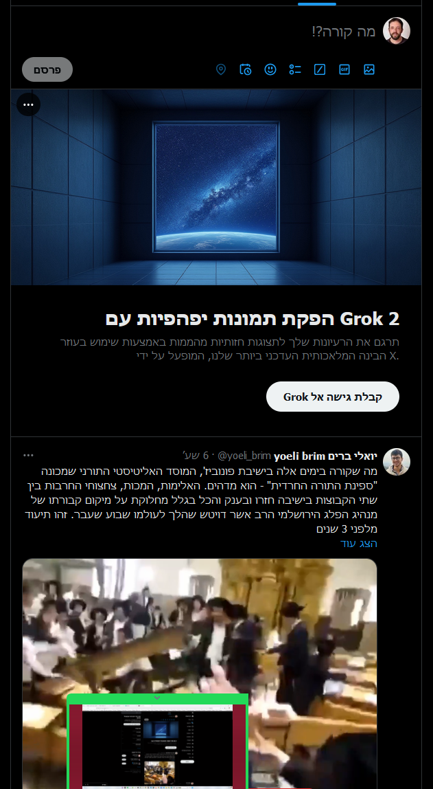

create instagram or X like home page puzzle
make a component for feed, and under it a component for stories.
use array to store the data for the feed and stories.
try to use sub-components for the stories.

    